<picture>
  <source media="(prefers-color-scheme: dark)" srcset="assets/header-dark.svg">
  <source media="(prefers-color-scheme: light)" srcset="assets/header-light.svg">
  
</picture>

  &nbsp;
  &nbsp;
  &nbsp;
  &nbsp;
  

### Building now

<table>
  <tr>
    <td width="50%" valign="top">
      <h4><a href="https://kizuki.dev">Kizuki</a></h4>
      A study tool that runs on your computer. You teach a concept back, and a local model asks about what you got wrong or left out, quoting your own course material.
        
      <code>TypeScript</code> <code>Next.js</code> <code>SQLite</code> <code>Ollama</code>
        
      <a href="https://github.com/connortessaro/kizuki">Code</a> · <a href="https://www.npmjs.com/package/kizuki">npm</a>
    </td>
    <td width="50%" valign="top">
      <h4><a href="https://ringi.dev">Ringi</a></h4>
      A Slack app for team decisions. It asks each person for their view in private, finds the real disagreement, and posts a brief with one recommendation. It runs on Gemini: in my tests Claude made up numbers when people's facts conflicted, and cost more. Langfuse logs each model call.
        
      <code>TypeScript</code> <code>Slack Bolt</code> <code>PostgreSQL</code> <code>Langfuse</code>
        
      <a href="https://ringi.dev">Website</a>
    </td>
  </tr>
  <tr>
    <td width="50%" valign="top">
      <h4><a href="https://phantom.codes">Phantom AI</a></h4>
      An AI API that works with OpenAI's client libraries. You pay up front for a key, by card or with crypto on Solana. Each call returns a signed receipt of the model, tokens and cost. A key can make child keys, each with its own spending limit, for subagents.
        
      <code>TypeScript</code> <code>Next.js</code> <code>PostgreSQL</code> <code>Stripe</code> <code>Solana</code>
        
      <a href="https://phantom.codes">Website</a>
    </td>
    <td width="50%" valign="top">
      <h4><a href="https://github.com/connortessaro/pai">pai</a></h4>
      The open-source client for Phantom AI: a command-line tool and an MCP server, the format AI agents use to call tools. Agents use it to make child keys, set budgets, and buy credit from a wallet.
        
      <code>TypeScript</code> <code>Node.js</code> <code>MCP</code>
        
      <a href="https://github.com/connortessaro/pai">Code</a> · <a href="https://www.npmjs.com/package/@connortessaro/pai">npm</a>
    </td>
  </tr>
</table>

### Open source

- **[prisma/orm](https://github.com/prisma/orm)**: fixed dates coming back as `Invalid Date` in the SQLite adapter ([#29274](https://github.com/prisma/orm/pull/29274)), and added the `distinct` option to the `findMany` docs, closing a request open since 2021 ([#29269](https://github.com/prisma/orm/pull/29269)).

### Earlier projects

- **[Prooflane](https://github.com/connortessaro/prooflane)**: a Shopify app that flags orders likely to end in an "item not received" chargeback and suggests what to do before the buyer files one.
- **[LeagueIQ](https://github.com/connortessaro/leagueiq)**: after-game analysis that measures each player's impact from Riot Games match data.

### Stack

  
   
  
   
  

Also: Snowflake, Drizzle ORM, Langfuse, Ollama.
